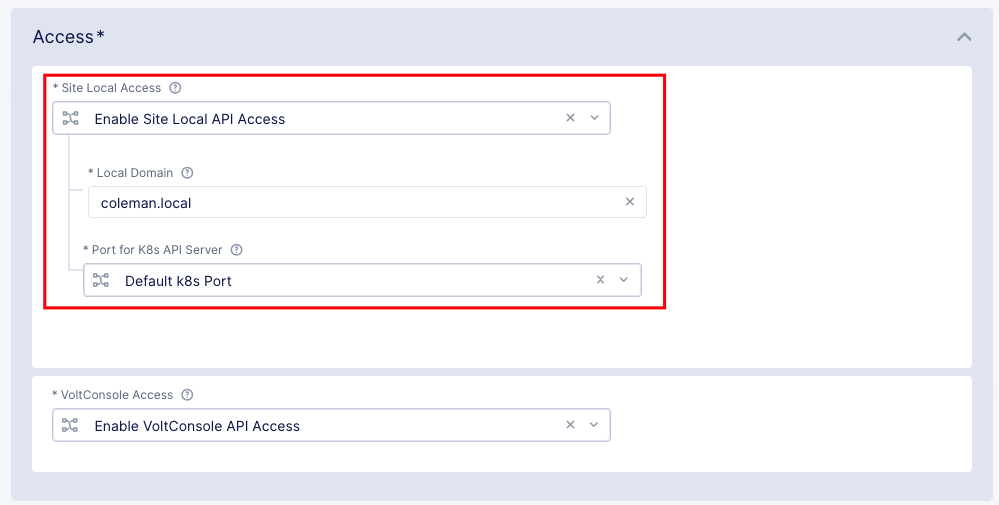
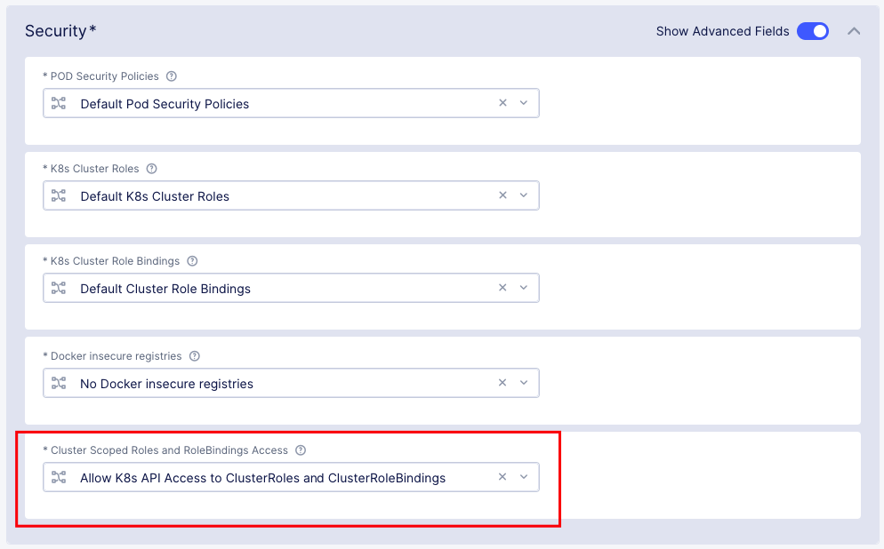

# Threat Stack on AppStack (Managed K8s) Deployment Yaml

This file is a template for deploying the Threat Stack agent on F5 XCS Managed Kubernetes. This is meant as a base to build off of. Users may wish to change the namespace, the resource limits, etc.

- Note: The ThreatStack agent requires elevated permissions today, and is therefore not currently compatible with deployment via vK8s or Regional Edge based deployments.

## Prerequisites

- Note: In case of managed K8s, Role and RoleBinding operations are supported via kubectl. However, ClusterRoleBinding, PodSecurityPolicy, and ClusterRole are not supported for kubectl. These can be configured only through F5 Destributed Cloud Console.

- Create Managed K8s Site / AppStack in F5 XCS [https://docs.cloud.f5.com/docs/how-to/app-management/create-deploy-managed-k8s](https://docs.cloud.f5.com/docs/how-to/app-management/create-deploy-managed-k8s)
- Create K8s ClusterRole for threatstack-agent [threatstack-agent-clusterrole](./k8sClusterRole.json)
- Create K8s ServiceAccount for threatstack-agent.  This is included in the manifest.
- Create K8s ClusterRoleBinding for threatstack-agent [threatstack-agent-clusterrole](./k8sClusterRoleBinding.json)

### Managed K8s Settings

Make sure to enable local kube-api access as seen below:


Make sure to allow K8s API access to ClusterRoles and ClusterRoleBindings as seen below:


## Usage

```bash
# with $DEPLOY_KEY set to your organization's deploy key
sed -i "s/<REPLACE_WITH_VALID_DEPLOY_KEY>/$DEPLOY_KEY/g" TSKubernetesDaemonSet.yaml
kubectl apply -f TSKubernetesDaemonSet.yaml
```

## Questions?

Please contact your F5 team. We may be not monitoring issues or pull requests through github.
